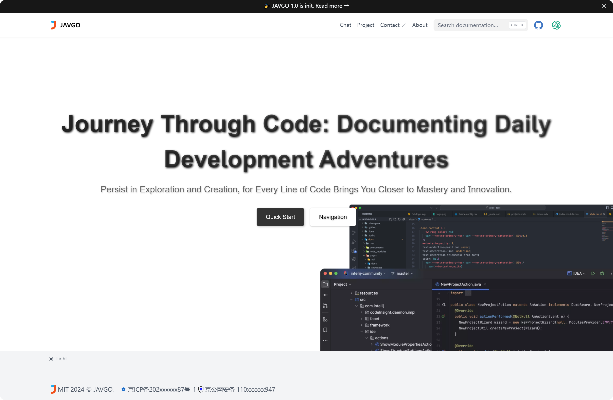

# JAVGO Web

本项目用于分享日常工作中的相关技术文档，一起进步吧！

[**快速阅读 →**](https://www.javgo.cn)

[](https://www.javgo.cn)

## 本地部署

首先运行如下命令安装相关依赖：

```bash
pnpm i
```

然后运行如下命令启动开发服务器，并访问 localhost:3000：

```bash
pnpm dev
```

每次编写完 MD 格式的文章后，在项目根目录下执行如下命令即可将 .md 文件转为 .mdx 文件，且自动替换 MD 的超链接语法和图片语法为系统优化后的样式：

```bash
node .\replace-mdx.js
```

## License

This project is licensed under the MIT License.
